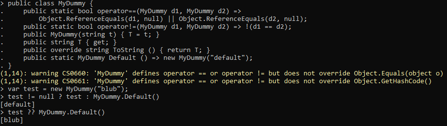
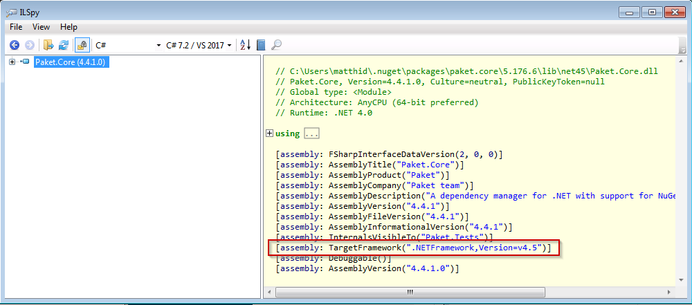

## Advanced C# and internals


### **Matthias Dittrich**, QPLIX GmbH <br /> [@matthi\_\_d](http://twitter.com/matthi__d) | [github matthid](https://github.com/matthid) | [qplix.com](https://www.qplix.com/)

***

### Roadmap

- **Meta**
- C# Language Spec
- Corner cases
- Breaking changes
- Compiler Internals
- Runtime & EcoSystem


---

### Meta

- Not complete
- Spec is huge
- Lots of stuff we might skip
- Most samples can be run in CSI
- Some samples can fill their own lecture...

<!--
This really is an advanced lecture, don't feel bad if you don't understand some things.
See them as an adventure to learn more about the language you work with every day :)
-->

***

### Roadmap

- Meta
- **C# Language Spec**
- Corner cases
- Breaking changes
- Compiler Internals
- Runtime & EcoSystem

---

```csharp
namespace People;

public class Employee 
{ /* ... */ }

```

Q01_a: Which other access modifiers could alternatively be applied to this class:

1. `internal`, `protected` and `private`
2. `internal`, `private`
3. `protected` and `private`
4. `internal`, `private` and `protected internal`
5. `internal` 

---

```csharp
namespace People;

public class ProtectedPrivate 
{ 
    protected private ProtectedPrivate(){}
}

```

Q01_b: What does `protected private` mean?

1. access like `private` OR `protected`
   (access is allowed when `private` or `protected` alone would allow the access)
2. access like `private` AND `protected`
3. access like `internal` OR `protected`
4. access like `internal` AND `protected`
5. access like `protected internal`

<!--
Introduced in C# 7.2, November 15th, 2017
-->

---

Q02: What is equivalent to `char ch = ' ';`?

1. `char ch = "d32";`
2. `char ch = "\x20";`
3. `char ch = '0x20';`
4. `char ch = '\x20';`
5. `char ch = 32;`


---

```csharp
public static class NumberWriter {
    public static void Display(int x) {
        Console.WriteLine("Integer: " + x);
    }
    public static void Display(long x) {
        Console.WriteLine("Long: " + x);
    }
}
short value = 10;
NumberWriter.Display(value);
```

Q03: What will happen?

1. `"Long: 10"`
2. `"Integer: 10"`
3. throws `RuntimeBinderException`
4. Doesn't compile

---

```csharp
dynamic value = 321;
Console.WriteLine(value.Length);
```

Q04_a: What will happen?

1. `"321"`
2. `"3"`
4. throws `RuntimeBinderException`
3. Doesn't compile

---

### DLR

```csharp
public static dynamic From(object wrapped) { /*...*/ }
class Class1 { public readonly int _sd = 1; }
class Class2 { public readonly int _sd = 2; }
public static void SetFieldHelperDemo(){
    var c1 = new Class1(); var d1 = From(c1);
    var c2 = new Class2(); var d2 = From(c2);
    d1._sd = 11;
    d2._sd = 22;
    Console.WriteLine($"c1._sd = {c1._sd}");
    Console.WriteLine($"c2._sd = {c2._sd}");
}
```

<style scoped>section { font-size: 20px; }</style>

Q04_b: What can you do with DLR/Reflection? 

1. only print `1` and `2` 
2. Can print any numbers
3. Can print anything
4. Doesn't compile

[Thanks to ExposedObject](https://github.com/skolima/ExposedObject)

<!--
Sidenotes:
- No Exceptions
- No mangling with the stack
- Only the WriteLine Statements are considered (additional output is ignored)
-->

---

```csharp
public static dynamic From(object wrapped) { /*...*/ }
class Class1 { public static readonly int _sd = 1; }
class Class2 { public static readonly int _sd = 2; }
public static void SetFieldHelperDemo(){
    var c1 = new Class1(); var d1 = From(c1);
    var c2 = new Class2(); var d2 = From(c2);
    d1._sd = 11;
    d2._sd = 22;
    Console.WriteLine($"c1._sd = {c1._sd}");
    Console.WriteLine($"c2._sd = {c2._sd}");
}
```


<style scoped>section { font-size: 20px; }</style>

Q04_c: What can you do with DLR/Reflection? 

1. always prints `1` and `2` 
2. Can print any numbers
3. Can print anything
4. Doesn't compile

<!--
 error CS0176: Member 'SetFieldHelper.Class1._sd' cannot be accessed with an instance reference; qualify it with a type name instead [C:\proj\AdvancedCSharp\demo\demo.csproj]
-->

---

```csharp
public static dynamic From(object wrapped) { /*...*/ }
class Class1 { public static readonly int _sd = 1; }
class Class2 { public static readonly int _sd = 2; }
public static void SetFieldHelperDemo(){
    var c1 = new Class1(); var d1 = From(c1);
    var c2 = new Class2(); var d2 = From(c2);
    d1._sd = 11;
    d2._sd = 22;
    Console.WriteLine($"Class1._sd = {Class1._sd}");
    Console.WriteLine($"Class2._sd = {Class2._sd}");
}
```

<style scoped>section { font-size: 20px; }</style>

Q04_d: What can you do with DLR/Reflection?

1. always prints `1` and `2` 
2. Can print any numbers
3. Can print anything
4. Doesn't compile


---

- Demo

---

### Exception-Filter

```csharp
static void DoSomething() { throw new Exception("Test"); }
static bool MyCondition(Exception ex) { return false; }
static void Main1() {
    try { DoSomething(); }
    catch (Exception ex) when (MyCondition(ex)) {
        Console.WriteLine("Error 42 occurred"); 
    }
} 
static void Main2() {
    try { DoSomething(); }
    catch (Exception ex) {
        if (MyCondition(ex))
            Console.WriteLine("Error 42 occurred");
        else throw;
    }
}
```

<!-- 
Stack is does not unwind
Debugger does not halt (first chance exception)
-->

---

```csharp
static bool MyCondition(Exception ex) {
    Console.WriteLine(Environment.StackTrace);
    return false;
}
```

```
> Main1()
   at System.Environment.get_StackTrace()
   at Submission#76.MyCondition(Exception ex)
   at Submission#77.Main1()
   at Submission#71.DoSomething()
   at Submission#77.Main1()
```

```
> Main2()
   at System.Environment.get_StackTrace()
   at Submission#76.MyCondition(Exception ex)
   at Submission#78.Main2()
```

---

```csharp
static bool MyCondition(Exception ex) {
    Logger.Error("Error happened", ex);
    return false;
}
```

<!-- Use case: Logging -->

---

```csharp
static void DoSomething() { throw new ArgumentException("ArgumentExn"); }
static bool MyCondition(Exception ex) { throw new IOException("IOExn"); }
static void Main() {
    try { DoSomething(); }
    catch (ArgumentException ex) when (MyCondition(ex)) {
        Console.WriteLine("Catched ArgumentException"); 
    }
}
```

Q05_a: Will happen with the above code?

1. prints `"Catched ArgumentException"`
2. Unhandled Exception: `ArgumentException`
3. Unhandled Exception: `IOException`
4. Runtime crashes

---

```csharp
static void DoSomething() { throw new ArgumentException("ArgumentExn"); }
static bool MyCondition(Exception ex) { throw new IOException("IOExn"); }
static void Main() {
    try { DoSomething(); }
    catch (ArgumentException ex) when (MyCondition(ex)) {
        Console.WriteLine("Catched ArgumentException"); 
    }
    catch (ArgumentException ex) {
        Console.WriteLine("Catched ArgumentException (2)"); 
    }
}
```

Q05_b: Will happen with the above code?

1. prints `"Catched ArgumentException"`
2. prints `"Catched ArgumentException (2)"`
2. Unhandled Exception: `ArgumentException`
3. Unhandled Exception: `IOException`
4. Runtime crashes

***

### Roadmap

- Meta
- C# Language Spec
- **Corner cases**
- Breaking changes
- Compiler Internals
- Runtime & EcoSystem

---


### Disclaimer

[https://stackoverflow.com/questions/194484/whats-the-strangest-corner-case-youve-seen-in-c-sharp-or-net](https://stackoverflow.com/questions/194484/whats-the-strangest-corner-case-youve-seen-in-c-sharp-or-net)

---

### 0

```csharp
enum Symbol { Alpha = 1, Beta = 2, Gamma = 3, Delta = 4 };
class Mate {
  static void Main(string[] args) {
    JustTest(Symbol.Alpha);
    JustTest(0);
    JustTest((int)0);
    JustTest(Convert.ToInt32(0));
    int i = 0; JustTest(i);
    JustTest(1);
    JustTest("string");
    JustTest(Guid.NewGuid());
    JustTest(new DataTable()); }

  static void JustTest(Symbol a) {
    Console.WriteLine("Enum"); }

  static void JustTest(object o) {
    Console.WriteLine("Object"); } }
```

<style scoped>section { font-size: 20px; }</style>

Q06: How often is "Enum" written?

1. 1 time
2. 3 times
2. 5 times
2. 6 times

---

### Structs

```csharp
public struct Teaser {
  public void Reset() {
    this = new Teaser();
  }
}
```

Q07_a: What happens?

1. compiler error
1. runtime error
2. overwrites "this" with a new instance

--- 

```csharp
public readonly ref struct Measurement
{
    public Measurement() { Values = new[]{ double.NaN }; }
    public ReadOnlySpan<double> Values { get; init; }
    public readonly string Description { get; init; }

    public readonly Measurement SetValue(ReadOnlySpan<double> values) => this with { Values = values };
}
```

Q07_b: How many compiler errors?

1. None
2. 1
3. 2
4. At least 3

<!--
ref struct = C# 7.2 Feature
readonly instance members = C# 8 Feature
readonly init property = C# 9 Feature
with expression = C# 10 Feature
-->

--- 

### Refactoring

```csharp
public class MyDummy {
    public MyDummy(string t) { T = t; }
    public string T { get; }
    public override string ToString () { return T; }
    public static MyDummy Default () => new MyDummy("default");
}
var test = new MyDummy("blub");
```

```csharp
test != null ? test : MyDummy.Default()
```
```csharp
test ?? MyDummy.Default()
```

Q08: Is the refactoring safe for all types?

1. Yes both with return the same instance
2. No

---

```csharp
public class MyDummy {
    // ...
    public static bool operator==(MyDummy d1, MyDummy d2) =>
        Object.ReferenceEquals(d1, null) ||
        Object.ReferenceEquals(d2, null);
    public static bool operator!=(MyDummy d1, MyDummy d2) =>
        !(d1 == d2);
}
```



---

### Dynamic?

```csharp
public class Base {
  public virtual void Initialize(dynamic stuff) { }
}
public class Derived : Base {
  public override void Initialize(dynamic stuff) {
    base.Initialize(stuff);
  }
}

```

Q09: What happens here?

- compiler error
- runtime error
- calls base method

<!--
(4,4): error CS1971: The call to method 'Initialize' needs to be dynamically dispatched, but cannot be because it is part of a base access expression. Consider casting the dynamic arguments or eliminating the base access.

Edge case, normally it would be a dynamic dispatch but for overrides it has to know.
-->

---

### Literals

```csharp
bool abool = true;
Byte by1 = (abool ? 1 : 2);
Byte by2 = (true ? 1 : 2);
```

Q10: which answer is correct?

1. `by1` and `by2` are assigned the same number
2. `by1` and `by2` are assigned different numbers
3. Compiler error on Line 2 (assignment of `by1`)
4. Compiler error on Line 2 & 3


***

### Roadmap

- Meta
- C# Language Spec
- Corner cases
- **Breaking changes**
- Compiler Internals
- Runtime & EcoSystem

---

### Breaking changes

- Binary-level break
- Binary-level quiet semantics change
- Source-level break
- Source-level quiet semantics change

[https://stackoverflow.com/questions/1456785/a-definitive-guide-to-api-breaking-changes-in-net](https://stackoverflow.com/questions/1456785/a-definitive-guide-to-api-breaking-changes-in-net)

---

### Adding a member

```csharp
 public class Foo
 {
+  public void Bar() { }
 }
```

Q11: Which kind of breaking change is it (select all that apply)?

1. binary-level break
2. binary-level quiet semantics change
3. source-level break
4. source-level quiet semantics change
5. None of the above


<!-- 
source-level quiet semantics change. (extension methods)
-->

---

### Changing return type

```csharp
 public static class Foo
 {
-  public static void bar(int i);
+  public static bool bar(int i);
 }
```

Q12: Which kind of breaking change is it (select all that apply)?

1. binary-level break
2. binary-level quiet semantics change
3. source-level break
4. source-level quiet semantics change
5. None of the above

<!--
binary breaking change
source-level break (used in lambda)
-->

---

### Enum?

```csharp
 enum MyEnum
 {
     Red,
+    Black,
     Blue,
 }
```


Q13: Which kind of breaking change is it (select all that apply)?

1. binary-level break
2. binary-level quiet semantics change
3. source-level break
4. source-level quiet semantics change
5. None of the above

<!--
binary-level quiet semantics change
-->

---

### Default parameter?

```csharp
-public void MyDummy(string s, int v = 4);
+public void MyDummy(string s, int v = 4, int w = 3);
```

Q14: Which kind of breaking change is it (select all that apply)?

1. binary-level break
2. binary-level quiet semantics change
3. source-level break
4. source-level quiet semantics change
5. None of the above
<!--
binary breaking change
-->

---

### Refactoring

```csharp
class Foo {
    public virtual void Bar() {}
    public virtual void Baz() {}
}
```

```csharp
class FooBase {
    public virtual void Bar() {}
}
class Foo : FooBase {
    public virtual void Baz() {}
}
```

<style scoped>section { font-size: 20px; }</style>

Q15: Which kind of breaking change is it (select all that apply)?

1. binary-level break
2. binary-level quiet semantics change
3. source-level break
4. source-level quiet semantics change
5. None of the above
<!--
not breaking
-->

---

### Refactoring

```csharp
interface IFoo {
    void Bar();
    void Baz();
}
```

```csharp
interface IFooBase {
    void Bar();
}
interface IFoo : IFooBase {
    void Baz();
}
```

<style scoped>section { font-size: 20px; }</style>

Q16: Which kind of breaking change is it (select all that apply)?

1. binary-level break
2. binary-level quiet semantics change
3. source-level break
4. source-level quiet semantics change
5. None of the above
<!--
Explicit implementations -> Source
binding breaks -> Binary
-->

***

### Roadmap

- Meta
- C# Language Spec
- Corner cases
- Breaking changes
- **Compiler Internals**
- Runtime & EcoSystem

---

### Compiler features

```csharp
class MyEnumerator {
    private bool finished;
    public object Current { get; } = "ok";
    public bool MoveNext() { var f = finished; finished = true; return !f; }
}
class Test {
    public MyEnumerator GetEnumerator() => new MyEnumerator();
}
var t = new Test();
foreach(string s in t) { Console.WriteLine(s); }
```

Q20: What will happen?

1. compile error
2. runtime error
3. prints "ok"

<!--
Where is IEnumerable<>?
Most compiler "duck"-typed -> Extendible
-->

---

### Yield Return?

```csharp
public IEnumerable<int> GetFirst10Nos() {
    for (int i = 0; i < 10; i++)
        yield return i;
}
```

---

```csharp
public IEnumerable<int> GetFirst10Nos() {
    <GetFirst10Nos>d__0 d__ = new <GetFirst10Nos>d__0(-2);
    d__.<>4__this = this;
    return d__;
}
```

<!--
<GetFirst10Nos>d__0 implements IEnumerable & IEnumerator
-->

---

### Async

```csharp
[AsyncMethodBuilder(typeof(MyTaskBuilder))]
class MyTask {
    public Awaiter GetAwaiter();
}
class Awaiter : INotifyCompletion {
    public bool IsCompleted { get; }
    public void GetResult();
    public void OnCompleted(Action completion);
}
class MyTaskBuilder {
    public static MyTaskBuilder Create() => null;
    public void Start<TStateMachine>(ref TStateMachine stateMachine) where TStateMachine : IAsyncStateMachine { }
    public void SetStateMachine(IAsyncStateMachine stateMachine) { }
    public void SetResult() { }
    public void SetException(Exception exception) { }
    public MyTask Task => default(MyTask);
    public void AwaitOnCompleted<TAwaiter, TStateMachine>(ref TAwaiter awaiter, ref TStateMachine stateMachine)
      where TAwaiter : INotifyCompletion where TStateMachine : IAsyncStateMachine { }
    public void AwaitUnsafeOnCompleted<TAwaiter, TStateMachine>(ref TAwaiter awaiter, ref TStateMachine stateMachine)
      where TAwaiter : ICriticalNotifyCompletion where TStateMachine : IAsyncStateMachine { }
}
```

---

[https://weblogs.asp.net/dixin/understanding-c-sharp-async-await-1-compilation](https://weblogs.asp.net/dixin/understanding-c-sharp-async-await-1-compilation)


***

### Roadmap

- Meta
- C# Language Spec
- Corner cases
- Breaking changes
- Compiler Internals
- **Runtime & EcoSystem**

---

### ExecutionContext

- similar to thread local storage but for an asynchronous world
- `AsyncLocal<T>`
- `var ec = ExecutionContext.Capture();`
- `ExecutionContext.Run(ec, delegate)`
- `CallContext`

---

### SynchronizationContext

- Abstraction for a specific environment
- for example WPF-UI-Thread / ASP.NET Request
- independent of concrete implementation (WPF <> WinForms)
- !`SynchronizationContext.Current` "flows" with `ExecutationContext`

---

### Async "SwitchTo"

- Demo

---

### Runtime & EcoSystem

1. in .NET only a single assembly with the same name (+PublicKeyToken) can be loaded
2. .NET will automatically redirect all assembly requests to the latest version 
3. NuGet package version matches the version of the assembly

<!-- 
Which statement is not true?
1. It depends: Within a single AssemblyLoadContext (previously AppDomain) yes.
2. See 1
3. No
-->

---

### Change runtime behavior

app.config

https://docs.microsoft.com/en-us/dotnet/framework/configure-apps/file-schema/runtime/index

runtimeconfig.template.json
https://docs.microsoft.com/en-us/dotnet/core/runtime-config/#runtimeconfigjson
https://docs.microsoft.com/en-us/dotnet/core/project-sdk/msbuild-props#runtime-configuration-properties

---

```csharp
List<int> list = new List<int>() { 1, 2, 3 };
list.ForEach(i =>
{
    Console.WriteLine(i);
    if (i < 3) { list.Add(i + 1); }
});
```

Q22: What will happen?

1. prints 1, 2, 3, 2, 3, 3
2. throws `"Collection was modified"`

---

```csharp
Console.WriteLine("Uri: " + new Uri("http://my.ser/path./item"));
```

Q23: What will happen?

1. prints `http://my.ser/path./item`
2. prints `http://my.ser/path/item`

---



---

### Thank you!

Further reading

* https://channel9.msdn.com/Events/TechDays/Techdays-2016-The-Netherlands/C-Language-Internals
* https://stackoverflow.com/questions/194484/whats-the-strangest-corner-case-youve-seen-in-c-sharp-or-net
